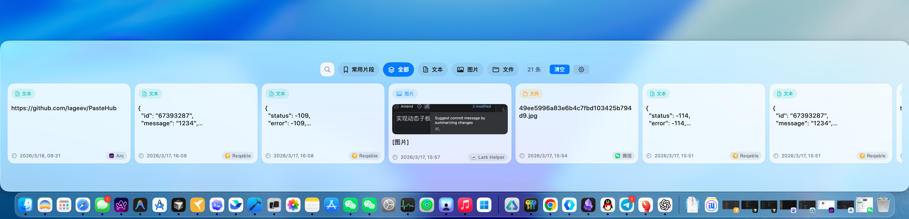

# PasteHub

PasteHub 是一个 macOS 状态栏剪贴板工具：自动记录复制内容，通过浮动面板快速检索，并支持一键回填到原应用输入框。



## 主要功能

- **剪贴板历史**：自动监听文本、图片、文件三类内容
- **历史 + 常用片段双模式**：支持在同一面板内切换浏览与操作
- **快速检索**：支持搜索、类型筛选（全部/文本/图片/文件）、标签筛选
- **紧凑模式面板**：支持显示密度（宽松/均衡/紧凑）、面板位置与面板大小
- **全局快捷键**：支持分别设置「显示/隐藏面板」「打开设置窗口」「清空历史记录」
- **键盘快速操作**：支持方向键选中、回车激活、`Cmd + 数字/字母` 快速选择
- **自动回填**：点击条目后先复制，再尝试切回原应用执行粘贴（需辅助功能权限）
- **标签体系**：历史条目与常用片段都可编辑标签
- **分词选择**：文本条目可进入分词选择后再回填
- **排除应用**：可配置不记录指定应用的剪贴板内容
- **开机自启**：通过 `SMAppService` 注册 Login Item

## 运行要求

- 使用 Xcode 打开并运行 `PasteHub.xcodeproj`
- 当前工程 `MACOSX_DEPLOYMENT_TARGET` 为 `26.2`

## 快速开始

1. 打开 `PasteHub.xcodeproj`
2. 选择 `PasteHub` Scheme
3. Build & Run
4. 首次运行后在菜单栏可看到应用图标
5. 按默认快捷键 `Cmd+Shift+V` 呼出面板

## 使用说明

- 复制任意文本/图片/文件后，内容会自动进入历史
- 面板支持搜索、类型筛选和标签筛选
- 单击历史卡片会执行“复制并回填”
- 历史卡片支持：重新复制、编辑标签、删除、添加到常用片段（文本）
- 切换到“常用片段”模式可新建/编辑/删除片段并快速使用

### 面板内键盘操作

- 方向键：移动当前选中项
- 回车：激活当前选中项
- `Cmd + 1~0 / A~Z`：按可见顺序快速选择并激活
- 直接输入字符：自动进入搜索

## 设置页说明

- **通用**
  - 历史最大保留条数
  - 开机自动启动
  - 面板模式与布局（紧凑模式、密度、位置、大小、默认弹出方向）
- **快捷键**
  - 录制和修改全局快捷键
  - 查看辅助功能权限状态、路径信息和诊断入口
- **排除应用**
  - 从当前运行应用中快速加入排除名单
- **关于**
  - 版本信息与项目链接

## 权限说明

- **辅助功能权限（Accessibility）**
  - 用于自动切回目标应用并执行粘贴
  - 未授权时，剪贴板记录与手动复制仍可正常使用
  - 可在设置页的“辅助功能权限诊断”中刷新状态并跳转系统设置

## 数据存储

应用数据默认保存在：

`~/Library/Application Support/PasteHub/`

主要文件：

- `history.json`：历史记录
- `snippets.json`：常用片段
- `Images/`：图片剪贴板缓存

## 常见问题

### 应用闪退或提示无法打开

请在终端依次执行以下命令修复权限和签名：

```bash
chmod +x /Applications/PasteHub.app/Contents/MacOS/PasteHub
codesign --force --deep --sign - /Applications/PasteHub.app
```

## 项目结构

```text
PasteHub/
├── PasteHubApp.swift              # 应用入口
├── AppDelegate.swift              # 状态栏、浮窗、全局快捷键
├── Models/
│   ├── ClipboardItem.swift        # 剪贴板条目模型
│   └── SnippetItem.swift          # 片段模型
├── Services/
│   ├── ClipboardMonitor.swift     # 剪贴板轮询
│   ├── ClipboardStore.swift       # 存储与持久化
│   ├── PasteToAppService.swift    # 自动回填
│   └── SettingsManager.swift      # 偏好设置管理
└── Views/
    ├── ClipboardListView.swift    # 主面板 UI
    ├── CompactPanelLayout.swift   # 紧凑面板布局
    ├── FloatingPanel.swift        # 浮动面板窗口
    └── SettingsView.swift         # 设置窗口
```

## License

MIT

## 特别鸣谢

<div align="left">
  <a href="https://www.coolapk.com" target="_blank">
    
  </a>
</div>
